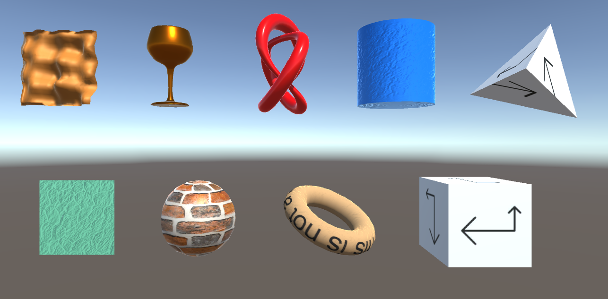
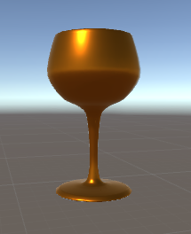
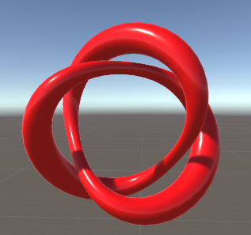
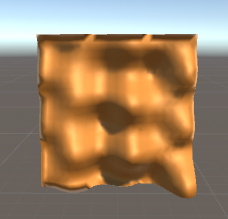
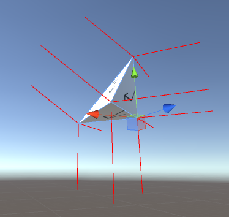
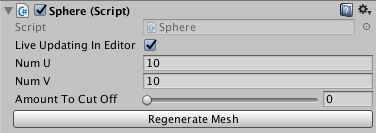

# CTModeler: A procedural model generator for Unity



This is a port of [Ken Perlin](http://mrl.nyu.edu/~perlin/)'s [WebGL-based procedural modeler-renderer](http://mrl.nyu.edu/~perlin/example3d_1/) to Unity in C#, which here allows you to create procedural models and meshes at runtime.

Features support for a variety of parametric surfaces, including surfaces of revolution…



…extruded surfaces… 

 

…and general parametric surfaces…



…among other tools for concisely creating procedural meshes through code at runtime. In particular, every shape in the included library has support for automatically generated UVs and normals.



Also included are customized inspectors that help you tweak your parameters and control when meshes are regenerated.



All this is done through a simple, concise interface. For example, here's all you need to define a torus:

```csharp
public class Torus : CT.Revolved {

    public float radius = 0.3f;

    protected override Vector2 RevolutionFunction(float t) {
        float phi = 2 * Mathf.PI * t;
        return new Vector2(1 - radius * Mathf.Cos(phi), -radius * Mathf.Sin(phi));
    }
}
```

Adding this script to any GameObject in the scene will cause the torus model to be dynamically generated and added to the object's MeshFilter, both in edit mode and at runtime.

## Requirements

This project was built with Unity 5.4. Other versions may also be compatible, but have not been thoroughly tested.

## How to get it

To start using CTModeler, clone or download this repository.

To get a sense of what the capabilities are, you can open the root directory as a project in Unity and open the scene at `Assets/Example Scene.unity`.

To use this in your own projects, copy the `Assets/CTModeler` directory to your own project's `Assets` directory.

## License

This project is licensed under the MIT license. See LICENSE.txt for the full license text.